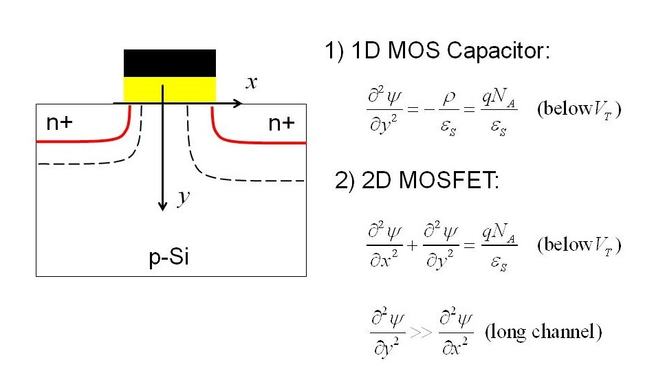

## Procedure

  
**Fig. 1. Gradual channel approximation**

  

**Steps to perform the real measurement in HP 4145B Semiconductor Parameter Analyzer**  

In this simulation, the bulk of the semiconductor is grounded and V is the voltage on the metal gate, tox is the thickness of the oxide, Eg is the band gap which can be temperature dependent, ϵox is the relative dielectric constant of the oxide, ϵs is the relative dielectric constant of the semiconductor, Es is the electric field at the semiconductor-oxide interface, Q is the charge on the charge on the semiconductor, ϕm is the work function of the metal, χs is the electron affinity of the semiconductor, Vs is the voltage at the semiconductor-oxide interface, T is the absolute temperature, NA is the concentration of acceptors, Nc(300) is the effective density of states in the conduction band at 300 K, and Nv(300) is the effective density of states in the valence band at 300 K. Note that in the band diagram, the band gap of the oxide is drawn 2 eV larger than the band gap of the semiconductor. In reality, the band gap of the oxide would be much larger but it is easier to see the band bending when the diagram is plotted with a small band gap for the gate oxide.

The - and + buttons change the gate voltage by ±0.01±0.01\\pm 0.01 V.

When the metal and the semicondutor are electrically connected, electrons flow from the material with a low work function to the material with a high work function. This current flow stops when a built-in voltage is established that is equal to the work function difference, 

$$Vbi=ϕm−ϕsVbi=ϕm−ϕsV_{bi}=\phi_m-\phi_s$$.

The work function of a semiconductor depends on the electron affinity χsχs\\chi\_s and the doping, 

$$ϕs=χs+Ec−EFϕs=χs+Ec−EF\phi_s=\chi_s+E_c-E_F$$.
