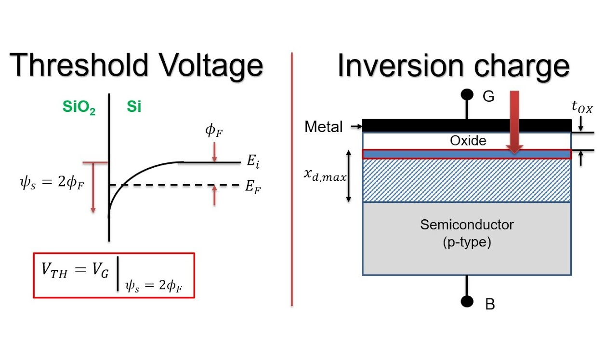

## Theory
**Introduction:**  
The boundary between accumulation and depletion is the flat-band voltage and the boundary between depletion and inversion is the threshold voltage.

  
**Fig. 1. Threshold Voltage and Inversion charge**

  

### MOS Capacitor's three regimes-Accumulation, Depletion, Inversion

A MOS Capacitor can be in three regimes: accumulation, depletion, and inversion [1,2]. The boundary between accumulation and depletion is the flat-band voltage, and the boundary between depletion and inversion is the threshold voltage. The flat-band voltage, denoted as $$V_{fb}$$ or $$V_{bi}$$, is defined as $$\phi_m - \phi_s$$, where $$\phi_m$$ is the work function of the metal and $$\phi_s$$ is the work function of the semiconductor substrate.

At the flat-band voltage, the bands are flat, resulting in an electric field of zero throughout the semiconductor. The hole concentration $$p$$ equals the acceptor concentration, and the charge density $$\rho$$ is zero.

Accumulation occurs when the gate voltage $$V$$ is negative, attracting holes to the oxide interface. This causes the valence band to bend up towards the Fermi energy, increasing the hole concentration $$p$$ near the oxide interface. The Fermi energy in the metal (represented by the black line on the left in the band diagram) moves up for negative voltages, indicating an increase in electron energy.

In the depletion regime, a positive gate voltage pushes mobile holes away from the oxide, leaving negatively charged acceptors behind. The valence band bends away from the Fermi energy at the oxide, resulting in a lower hole concentration near the oxide. The negative charge in the semiconductor is balanced by a positive charge on the metal surface, as indicated by the charge plot arrow. As the gate voltage increases positively, the depletion width grows, and the bands bend further down. Eventually, the conduction band gets closer to the Fermi energy than the valence band, leading to weak inversion where $$n > p$$ near the oxide. Strong inversion occurs when $$n = N_A$$ (acceptor concentration) at the oxide interface, at the threshold voltage $$V_T$$.

At $$V > V_T$$, an inversion channel forms at the semiconductor/oxide interface, characterized by a layer of mobile electrons. In the inversion state, the electric field in the semiconductor remains constant, while it increases within the oxide layer.

### Determining the band bending

To calculate the band bending, we start with Gauss's law,

$$\\begin{equation} \\nabla \\cdot \\vec{E} = \\frac{\\rho}{\\epsilon\_s\\epsilon\_0}. \\end{equation}$$

$$Combining \ this \ with \ \\vec{E}=-\\nabla V \ yields \ the \ Poisson \ equation,$$

$$\\begin{equation} \\nabla^2V = -\\frac{\\rho}{\\epsilon\_s\\epsilon\_0}, \\end{equation}$$

where, for a MOS capacitor with a p-type substrate, the charge density is 
$$\\rho = e\\left(-N\_A-n+p\\right)$$ and the charge carrier concentrations are,

$$\\begin{equation} n=N\_c(300)\\left(\\frac{T}{300}\\right)^{3/2}\\exp\\left(\\frac{E\_F-E\_c}{k\_BT}\\right)\\qquad \\text{and}\\qquad p=N\_v(300)\\left(\\frac{T}{300}\\right)^{3/2}\\exp\\left(\\frac{E\_v-E\_F}{k\_BT}\\right). \\end{equation}$$

Using the relation $$e\\frac{dV}{dx} = -\\frac{E\_v}{dx}$$ the Poisson equation can be written as a second order differential equation for $$E_v(x)$$,

$$ \\begin{equation} \\frac{d^2E\_v}{dx^2} = \\frac{e^2}{\\epsilon\_s\\epsilon\_0}\\left(-N\_A-N\_c\\exp\\left(\\frac{-E\_g-E\_v}{k\_BT}\\right)+N\_v\\exp\\left(\\frac{E\_v}{k\_BT}\\right)\\right). \\end{equation}$$

### Numerical

This differential equation was solved numerically using the shooting method [3]. First the maximum depletion width $$max(x_p)$$ and the threshold voltage $$V_T$$ are estimated using the analytic formulas from the depletion approximation.

$$\\begin{equation} x\_p = 2\\sqrt{\\frac{\\epsilon\_{\\text{semi}}\\epsilon\_0 k\_BT}{e^2N\_A}\\ln\\left(\\frac{N\_A}{n\_i}\\right)}. \\end{equation}$$ 

$$\\begin{equation} V\_T = \\frac{2t\_{ox}}{\\epsilon\_{ox}}\\sqrt{\\epsilon\_{\\text{semi}}N\_Ak\_BT \\ln \\left (\\frac{N\_A}{n\_i} \\right )} +\\frac{2k\_BT}{e} \\ln \\left (\\frac{N\_A}{n\_i} \\right ) +V\_{fb} \\end{equation}$$

Far from the oxide, the valence band satisfies the conditions $$E_v=k_BTln(N_AN_v)=E_{v0}E_v=k_BTln⁡(\frac{N_A}{N_v})=E_{v0}$$ and $$dE_vdx=0\frac{dE_v}{dx}=0$$. To determine the band bending, we start a distance of $$1.8x_p$$ from the oxide with $$E\_{v} = k\_BT\\ln\\left(\\frac{N\_A}{N\_v}\\right)=E\_{v0}$$ and a small value of $$dE_vdx=0\frac{dE_v}{dx}=0$$. The Poisson equation is integrated numerically using the midpoint method until the semiconductor oxide interface. This gives us the voltage $$V_s$$ at the semiconductor/oxide interface and the electric field $$E_s$$ at that point. The voltage on the gate is,

$$\\begin{equation} V = \\frac{\\epsilon\_{\\text{semi}}E\_s}{\\epsilon\_{\\text{ox}}}t\_{\\text{ox}}+V\_s. \\end{equation}$$

This is the correct gate voltage for the boundary conditions we chose on the right, but generally, it may not be the desired gate voltage. The starting position of integration is then adjusted either to the right or left, and the integration process is repeated until the calculated voltage, obtained through numerical integration, matches $$V_{shoot}$$. The simulation produces incorrect results if the valence band or conduction band approach within approximately $$3k_BT$$ from the Fermi energy. This limitation arises because the formulas for nnn and ppp are valid only when the valence and conduction bands are sufficiently far from the Fermi energy.

     
 
